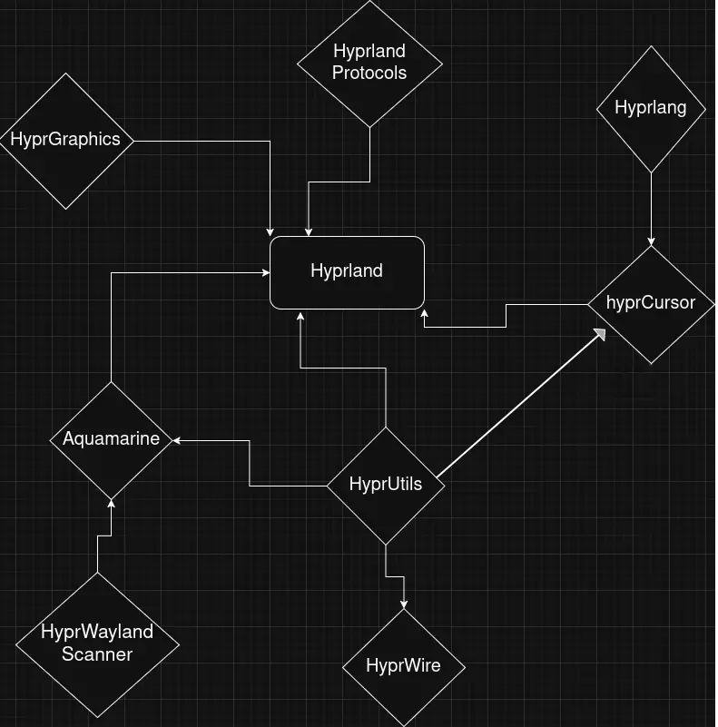

# Fedora 43 Build Deps

[hyprland repo](https://github.com/hyprwm)

## For core Hyprland and its deps

- aquamarine
- hyprcursor
- hyprgraphics
- hyprlang
- hyprutils
- hyprwayland-scanner
- hyprwire

```
cairo-devel
file-devel
gtest-devel
hwdata-devel
libdisplay-info-devel
libdrm-devel
libglvnd-devel
libinput-devel
libjpeg-turbo-devel
librsvg2-devel
libseat-devel
libuuid-devel
libwebp-devel
libX11-devel
libxcb-devel
libXcursor-devel
libxkbcommon-devel
libzip-devel
mesa-libgbm-devel
muParser-devel
pango-devel
perl-devel
pixman-devel
pugixml-devel
re2-devel
rust-libudev-devel
rust-wayland-client-devel
systemtap-sdt-devel
tomlplusplus-devel
uuid-c++-devel
uuid-devel
wayland-protocols-devel
xcb-util-devel
xcb-util-errors-devel
xcb-util-image-devel
xcb-util-wm-devel
```


