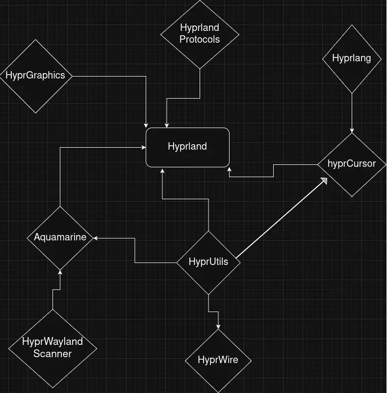

# About

This is a staging repository for keeping Hypland and its packages updated on fedora through [This copr](https://copr.fedorainfracloud.org/coprs/acidburnmonkey/hyprland/packages/).

# Install

```
sudo dnf copr enable acidburnmonkey/hyprland
sudo dnf install hyprland
```

<br>

# Build Deps

[hyprland repo](https://github.com/hyprwm)

## For core Hyprland and its deps

- aquamarine
- hyprcursor
- hyprgraphics
- hyprlang
- hyprutils
- hyprwayland-scanner
- hyprwire


